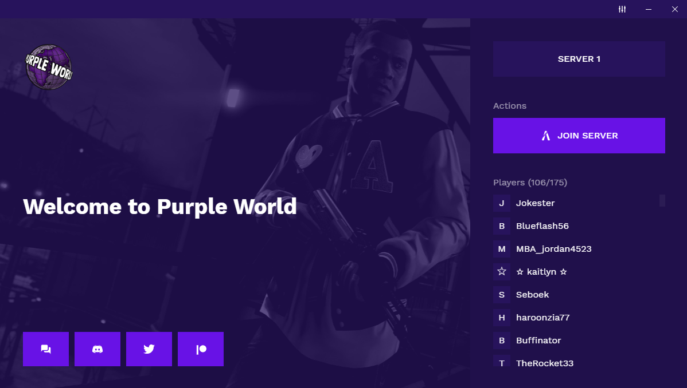

# FiveM Launcher

A custom FiveM launcher built with [Electron](https://www.electronjs.org/) and [React](https://reactjs.org/).

## Motivation

Since [FiveM](fivem.net) has previously announced prohibition of custom launchers and has actively obstructed various method of connection to servers from external applications, the project has been discontinued and open-sourced. There will be no further support provided for the launcher, however I believe there are some cool [features](#features) that could find a use in other projects.

## Features

#### Multiple servers support

The launcher supports a selection of multiple servers. Apart from direct FiveM connect button, each server can also have an accompanied button for external applications, such as TeamSpeak or similar.

#### Online players

For currently selected server, a periodically updated general information such as server status, count and names of players online, and maximum players count is displayed.

#### Multi-media backgrounds

The launcher can feature a variation of backgrounds, both images and videos. If multiple are enabled, there is a slideshow rotation. If there is currently a video displayed and the launcher window is not focused, the video will be paused to minimize resource load.

#### Automated application updates

A launched application automatically checks for updates. If there is a newer version available, it will be downloaded on the background and installed before next launch. The launcher can be packaged and released in a repository separate of its actual source code.

## Preview



## Notice

Some of the original data (mainly links and server addresses) have been redacted.


<hr />
<p align="center"><i>(original README below)</i></p>
<hr />

## Installation
1. Clone the repository and navigate to its location.
2. Install dependencies with yarn:
	```
    yarn
    ```
    
## Development

### Launching
- Start application in development environment with hot-reloading:
	```
    yarn dev
    ```
### Configuration
- Configuration files for FiveM, TeamSpeak, Discord and other links can be found in `app/configuration` folder.
    
## Packaging
Considering our custom release procedure, packaging is used to verify correct functionality of the upcoming release.

1. Package the application for the local platform:
	```
    yarn package
    ```
2. Application setup files can be found in `release` folder and the application itself in `release/[platform]-unpacked` folder.

## Update release
Update releases are distributed through a dedicated GitHub release repository *(link redacted)*. Once published, the latest application version is automatically downloaded by client and updated after restart.

### Initial setup
Before your first update release, you will need to setup your environment.
1. Configure the release repository in the `package.json` file (section `build->publish`) and make sure you have sufficient permissions to it.
2. Generate a new [personal access token](https://github.com/settings/tokens) for your GitHub account with `repo` scopes.
3. Set the token as `GH_TOKEN` environment variable in the project folder:
	
    In PowerShell: `$env:GH_TOKEN = "[your token here]"`
    
### Release procedure
1. Verify correct functionality of packaged application.
2. Commit all your changes and bump up the version of application in both `package.json` files (located in root and `app` folder):
	- Patch (`x.x.0 -> x.x.1`)
		```
        yarn release-version-patch
    	```
   - Minor (`x.0.x -> x.1.x`)
		```
        yarn release-version-minor
    	```
   - Major (`0.x.x -> 1.x.x`)
		```
        yarn release-version-major
    	```
3. Commit the generated version number and push all changes to the remote repository:
	```
    git push
    ```
4. Generate a draft of the release:
	```
    yarn release-draft
    ```
5. Once all files are uploaded, go to releases page *(link redacted)* in the release repository, download the setup file and re-verify correct functionality of the application.

6. Publish the release by clicking on the `Edit` button, providing optional release notes and publishing by clicking on the `Publish release` button.
       